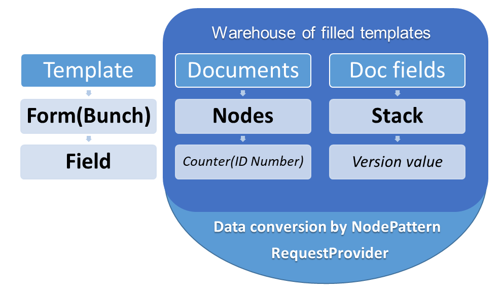

# MTDKey Storage

MTDKey Storage is a backend solution designed to speed up the development of forms-based applications. For example, web applications for order management.
Explore this code, you`ll find many useful features such as:
-	Switching between different databases in real time mode using Entity Framework
-	Using multiple database systems in one application (MSSQL and MySQL)
-	Row Level Security based on Access Token 
-	Control Save, Edit, and Delete Operations with a User Access Token
-	Using sql script files and raw requests in an Entity Framework application

  <strong>Main approach is creating database only once.</strong>

You can create application forms to enter information in any quantity without changing the structure of the database. Just create a form template and save it to the database. You can use the types of form fields – Text (unlimited size), Numeric, Boolean, Date time and List when one form is linked to another form.

  
  

### Database queries

The RequestProvider class is the primary gateway for database queries. Use the ContextProperty class to specify connection parameters such as access tokens, connection string, etc. 
You can use two options for connecting to the database.
The first way is to directly specify the connection string and database type (MySQL or MSSQL). For example, if you store the connection string for each user.

  The second way is to use the storage.json file, which should be in the same folder as the project.

    {
      "ConnectionStrings": {
        "mssql_ID1": "Server=127.0.0.1;Database=name; User ID=sa;Password=pwd",
        "mysql_ID2": "Server=127.0.0.1;Database=name;User Id=root;Password=pwd;SslMode=none;"
      }
    }

This way can be used if you store unique database IDs for each user, for example: ["user1","ID1"]
The storage.json file can store any quantity of connection strings. Each line must be prefixed to indicate that the database type is "mysql_" or "mssql_".

You can create a flexible application in which the user creates the databases himself. For example, from the user's personal account. At the same time, there is no need to create a complicated infrastructure.

Use the Request Provider by specifying a connection string  

    using RequestProvider requestProvider = new(contextProperty =>
    {
        contextProperty.DatabaseType = DatabaseType.MSSQL;
        contextProperty.ConnectionString = "connection string to your MSSQL database";
    });

  Use the Request Provider by specifying a Unique Database Name and storage.json file
  

  
    var dataBaseID = "ID1";
    var contextProperty = ContextConfig.GetConnectionString(dataBaseID);
    var databaseType = ContextConfig.GetDatabaseType(dataBaseID);
    using RequestProvider requestProvider = new(contextProperty =>
    {
        contextProperty.DatabaseType = databaseType;
        contextProperty.ConnectionString = connectionString;
    });

Methods of the RequestProvider class have incoming and out coming arguments as of special Schema collections, such as Form Schema, Field Schema, Node Schema. 

  Use the Save method to create or update data. If no identifier is specified in the Schema as an incoming parameter, a new record will be created.

    var createdForm = await requestProvider.FormSaveAsync(schema => {
                    schema.Name = "Form template name";
                    schema.Description = "Form description";
                    schema.ArchiveFlag = false;
                });
    //DataSet is List<FormSchema> because the RequestProvider may return many forms.
    var newID = createdForm.DataSet[0].FormId;

  Use the Query method by specifying Request Filter to find some data 

    var receivedNodes = await requestProvider.NodeQueryAsync(filter =>
    {
        filter.SearchText = "search word";
        filter.Page = 2;
        filter.PageSize = 50;
        filter.IncludeArchive = true;
    });

    // You can use linq to search 
    var firstNode = receivedNodes.DataSet.FirstOrDefault();
    var fields = first.Node.Items;
    
## License    
Copyright (c) – presented by [Oleg Bruev](https://github.com/olegbruev/).  
MTD Key Storage is free and open-source software licensed under the MIT License.

